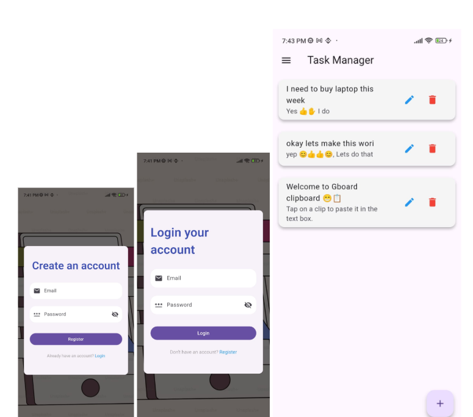

<!DOCTYPE html>
<html lang="en">

<body style="font-family: Arial, sans-serif; line-height: 1.6; margin: 20px; padding: 20px; max-width: 800px; background-color: rgb(20, 20, 20);">
<h1 style="color: #fff;">Task App - Teaching at Central Campus</h1>
 
A real-time task management application with Firebase Authentication (Email only).

<h2 style="color: #fff;">Repository</h2>
    
GitHub: <a href="https://github.com/sanam-tamang/firebase_flutter_task_app_central_campus_teaching" target="_blank" style="color: lightblue;">firebase_flutter_task_app_central_campus_teaching</a>

<h2 style="color: #fff;">Features</h2>
    <ul style="color: #fff;">
        <li>User authentication using Firebase Email & Password.</li>
        <li>Create tasks with a title and description.</li>
        <li>Read tasks in real-time.</li>
        <li>Update task details in real-time.</li>
        <li>Delete tasks instantly.</li>
    </ul>

 <h2 style="color: #fff;">Tech Stack</h2>
    <ul style="color: #fff;">
        <li>Flutter</li>
        <li>Firebase Authentication (Email & Password)</li>
        <li>Cloud Firestore (for real-time database operations)</li>
    </ul>

<h2 style="color: #fff;">Installation</h2>
    <pre style="background: #222; color: #fff; padding: 10px; border-radius: 5px; overflow-x: auto;"><code>git clone https://github.com/sanam-tamang/firebase_flutter_task_app_central_campus_teaching.git
cd firebase_flutter_task_app_central_campus_teaching
flutter pub get</code></pre>

<h2 style="color: #fff;">Firebase Setup</h2>
    
Follow these steps to set up Firebase:

    <ol style="color: #fff;">
        <li>Create a Firebase project at <a href="https://console.firebase.google.com/" style="color: lightblue;">Firebase Console</a>.</li>
    </ol>

 <h2 style="color: #fff;">Usage</h2>
    
Run the Flutter app with:

   
<pre style="background: #222; color: #fff; padding: 10px; border-radius: 5px; overflow-x: auto;"><code>flutter run</code></pre>

<h2 style="color: #fff;">Firestore Data Structure</h2>
    <pre style="background: #222; color: #fff; padding: 10px; border-radius: 5px; overflow-x: auto;"><code>{
"tasks": {
    "taskId1": {
        "id" : "taskId1",
        "title": "Task 1",
        "description": "This is task 1"
    }
  }
}</code></pre>

<h2 style="color: #fff;">Authentication</h2>
    
Users must sign in with an email and password before performing any task operations.

<h2 style="color: #fff;">Screenshots</h2>
    
UI:

    

<h2 style="color: #fff;">Contributing</h2>
    
Pull requests are welcome. For major changes, please open an issue first to discuss what you’d like to change.

</body>
</html>
